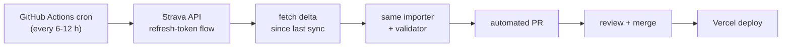

# Workout Map

Wayne's personal activity map: sanitized GPS tracks from Strava, rendered as
an interactive heat-style map. Live at **[map.waynewen.com](https://map.waynewen.com)**.

Static site, no backend: every byte the browser loads is a pre-generated
artifact committed to this repo. Data freshness is a property of the
pipeline, not the page.

## The data model in one paragraph

Strava data comes in three tiers: the **bulk export** (a ZIP of my complete
history, which is my own data with no API terms attached), the **API** (incremental
deltas, OAuth, server-side only), and **webhooks** (real-time push). v1 runs
entirely on tier 1: I download an export, a local importer turns it into
sanitized static JSON, and Vercel serves it. Tier 2 is designed but
deliberately deferred (see Roadmap); tier 3 will likely never be needed. The
browser never talks to Strava: no tokens, no CORS, no rate limits, no
policy surface.

## Pipeline


| Artifact | Contents |
|---|---|
| `activities.json` | One summary per outdoor GPS activity: name, type, date (day precision), distance, elevation, calories/heart rate where present |
| `tracks-<year>.geojson` | Clipped LineStrings, one feature per activity, 5-decimal coordinates |
| `stats.json` | Aggregates over **all** activities including indoor: counts, moving time, calories by type and year. Aggregates only; no per-activity records |
| `places.json` | Home at neighborhood precision (2-decimal grid), backing the home marker and indoor stats |

## Privacy model

Raw exports and zone config never leave my machine (`data/` is gitignored).
Before anything reaches `public/data/`:

- Points near configured private zones are removed at a **per-activity
  randomized radius** (500-1200 m), seeded by a secret salt, deterministic
  across runs, not computable from public data
- The first and last 5 points of every track are dropped unconditionally
- Dates only, never times; excluded activities are absent, not flagged
- `bun run validate:data` enforces all of this mechanically (assertions
  V1-V7) and gates every data commit

Home is shown deliberately, at ~1 km grid precision, a recorded decision,
not a leak. Full threat model: [docs/PRIVACY.md](docs/PRIVACY.md).

## Updating the data

```bash
# 1. Request a fresh export: Strava → Settings → My Account → Download Your Archive
# 2. Unzip into data/raw/   (only activities.csv and activities/ are read)

bun run import:strava        # parse → clip → write public/data/
bun run validate:data        # must be green
bun run dev                  # eyeball locally

git add public/data && git commit -m "data: update activities" && git push
# Vercel deploys automatically
```

If regeneration changes track geometry (not just properties or new
activities), stop and re-run the inspection checklist in
[docs/PRIVACY.md](docs/PRIVACY.md) before pushing.

## Development

```bash
bun install
bun run dev          # local dev server
bun run build        # tsc + vite build: must pass before commit
bun run lint
```

Stack: Vite + React 19 + TypeScript · Tailwind CSS v4 · MapLibre GL JS ·
OpenFreeMap basemaps · Bun · Vercel.

Docs: [docs/PLAN.md](docs/PLAN.md) (milestones + exit criteria) ·
[docs/DATA.md](docs/DATA.md) (schemas, determinism) ·
[docs/PRIVACY.md](docs/PRIVACY.md) (threat model). Coding agents read
[AGENTS.md](AGENTS.md) first.

## Roadmap: near-real-time sync (designed, not built)

Manual updates are fine until they aren't. When they get annoying, tier 2
activates, server-side only:



Same pipeline, same validator, same privacy gates: the only new pieces are
the cron trigger and token handling (GitHub Actions secrets; the browser
still never sees Strava). Gated on re-reading the then-current Strava API
agreement: see M6 in [docs/PLAN.md](docs/PLAN.md).
