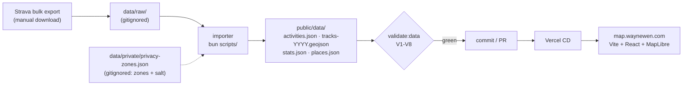
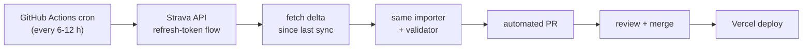

# Workout Map

Wayne's personal activity map: sanitized GPS tracks from Strava, rendered as
an interactive heat-style map. Live at **[map.waynewen.com](https://map.waynewen.com)**.

Static site, no backend: every byte the browser loads is a pre-generated
artifact committed to this repo. Data freshness is a property of the
pipeline, not the page.

## The data model in one paragraph

Strava data comes in three tiers: the **bulk export** (a ZIP of my complete
history, which is my own data with no API terms attached), the **API** (incremental
deltas, OAuth, server-side only), and **webhooks** (real-time push). v1 runs
entirely on tier 1: I download an export, a local importer turns it into
sanitized static JSON, and Vercel serves it. Tier 2 is designed but
deliberately deferred (see Roadmap); tier 3 will likely never be needed. The
browser never talks to Strava: no tokens, no CORS, no rate limits, no
policy surface.

## Pipeline



| Artifact | Contents |
|---|---|
| `activities.json` | One summary per outdoor GPS activity: name, type, date (day precision), distance, elevation, calories/heart rate where present |
| `tracks-<year>.geojson` | Clipped LineStrings, one feature per activity, 5-decimal coordinates |
| `stats.json` | Aggregates over **all** activities including indoor: counts, moving time, calories by type and year. Aggregates only; no per-activity records |
| `places.json` | Home at neighborhood precision (2-decimal grid), backing the home marker and indoor stats |

## Privacy model

Raw exports and zone config never leave my machine (`data/` is gitignored).
Before anything reaches `public/data/`:

- Points near configured private zones are removed at a **per-activity
  randomized radius** (500-1200 m), seeded by a secret salt, deterministic
  across runs, not computable from public data
- The first and last 5 points of every track are dropped unconditionally
- Dates only, never times; excluded activities are absent, not flagged
- `bun run validate:data` enforces all of this mechanically (assertions
  V1-V8) and gates every data commit

Home is shown deliberately, at ~1 km grid precision, a recorded decision,
not a leak. Full threat model: [docs/PRIVACY.md](docs/PRIVACY.md).

## Updating the data

Two disjoint sources, one pipeline (see [docs/PLAN.md](docs/PLAN.md) M8). Public
data stays a pure function of `data/raw/` (`export/` + `hammerhead/`). Each command
below **rebuilds and validates for you** — you only eyeball and commit.

**Rides** — from the Hammerhead Karoo, via the API (the common case):

```bash
bun run sync:rides   # first run opens a browser for one-time Hammerhead consent
                     # (grant activity:read ONLY). Then, unattended: fetch new ride
                     # FITs into data/raw/hammerhead/, rebuild public/data/ from the
                     # whole corpus, validate (V1-V8), and enforce the additive
                     # invariant:  ADDITIVE -> public/data updated (uncommitted)
                     #             MUTATING -> aborts + restores (a published track moved)
```

**Everything else** — indoor + misc, from a quarterly Strava bulk export:

```bash
# Strava -> Settings -> My Account -> Download Your Archive, unzip it
bun run update -- --from <unzipped-export-dir>
# replaces data/raw/export/ ONLY (never touches hammerhead/), rebuilds, validates,
# and prints the geometry-drift verdict.
```

Then, for either source:

```bash
bun run dev          # eyeball the new/updated tracks locally
git add public/data && git commit -m "data: update activities" && git push
# Vercel deploys automatically
```

New or changed tracks are new privacy surface — run the
[docs/PRIVACY.md](docs/PRIVACY.md) inspection checklist before pushing.
Properties/stats-only updates (no geometry change) don't need it.

**Automated (M9):** a daily GitHub Actions workflow (`.github/workflows/sync-rides.yml`)
runs `sync:rides --ci` — fetch new rides → clip → geometry-dedup → append →
validate (V1-V8) → additive guard — and **opens a PR** for you to inspect + merge.
It never merges itself. One caveat: CI-synced FITs don't reach your **local**
corpus, so before a quarterly `bun run update`, run `bun run sync:rides` locally
first to repopulate it (re-fetches everything not already local; no `public/data`
change). Setup + the trust-boundary rationale: [docs/PLAN.md](docs/PLAN.md) M9,
[docs/PRIVACY.md](docs/PRIVACY.md) R5.

## Development

```bash
bun install
bun run dev          # local dev server
bun run build        # tsc + vite build: must pass before commit
bun run lint
```

Stack: Vite + React 19 + TypeScript · Tailwind CSS v4 · MapLibre GL JS ·
OpenFreeMap basemaps · Bun · Vercel.

Docs: [docs/PLAN.md](docs/PLAN.md) (milestones + exit criteria) ·
[docs/DATA.md](docs/DATA.md) (schemas, determinism) ·
[docs/PRIVACY.md](docs/PRIVACY.md) (threat model). Coding agents read
[AGENTS.md](AGENTS.md) first.

## Roadmap: near-real-time sync (designed, not built)

> **Superseded (2026-07-06):** the Strava API stayed non-compliant for public
> display, so automated sync moved to the Hammerhead Karoo API (rides) with the
> quarterly Strava *export* for everything else. `bun run sync:rides` (M8) is the
> live local sync; the CI cron below is M9. See [docs/PLAN.md](docs/PLAN.md)
> M6-M9. The flow is unchanged in shape — only the source and the token handling
> differ.

Manual updates are fine until they aren't. When they get annoying, tier 2
activates, server-side only:



Same pipeline, same validator, same privacy gates: the only new pieces are
the cron trigger and token handling (GitHub Actions secrets; the browser
still never sees Strava). Gated on re-reading the then-current Strava API
agreement: see M6 in [docs/PLAN.md](docs/PLAN.md).
